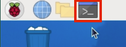

# Picamera zero (picamzero)

Picamera zero (`picamzero`) makes it easy for beginners to control a Raspberry Pi camera with Python.

---
### Install in a venv

Use this method if you want to run your programs via the command line.

1. Open a terminal window on your Raspberry Pi.

    

2. Type this command and press enter to install some packages you will need:

    ```
    sudo apt install -y libcap-dev python3-libcamera python3-opencv
    ```

3. Type this command to create a virtual environment (venv)

    ```
    python3 -m venv --system-site-packages venv
    ```

4. Type this command to start the virtual environment. You will need to do this each time you want to use picamzero.
    ```
    source venv/bin/activate
    ```

5. Finally, type this command to install picamzero

    ```
    pip3 install picamzero
    ```

---

### Install in Thonny

1. Open a terminal window on your Raspberry Pi.

    

2. Type this command and press enter to install some packages you will need:

    ```
    sudo apt install -y libcap-dev python3-libcamera python3-opencv
    ```

3. Type this command to create a virtual environment (venv)

    ```
    python3 -m venv --system-site-packages venv
    ```

4. From the Programming menu, open Thonny.

    

5. Click "Switch to regular mode" on the top right, then close and reopen Thonny.

6. Click **Run** > **Configure Interpreter**

7. Click on the three dots next to "Python executable".

8. Navigate to the directory where you created your `venv` and then enter the `bin` folder and click `python3` inside that folder. (If you didn't switch to a different directory this will be Home > venv > bin > python3.) Click OK to close the window.

8. Click **Tools** > **Manage packages**

9. Search for `picamzero` and then click **Install**.

Now you're good to go! Start by writing your [first program](hello_world.md).

