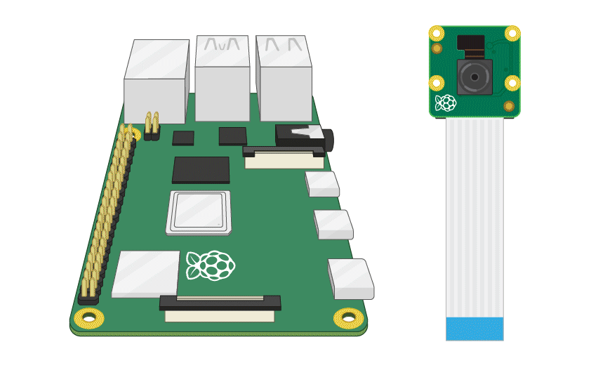
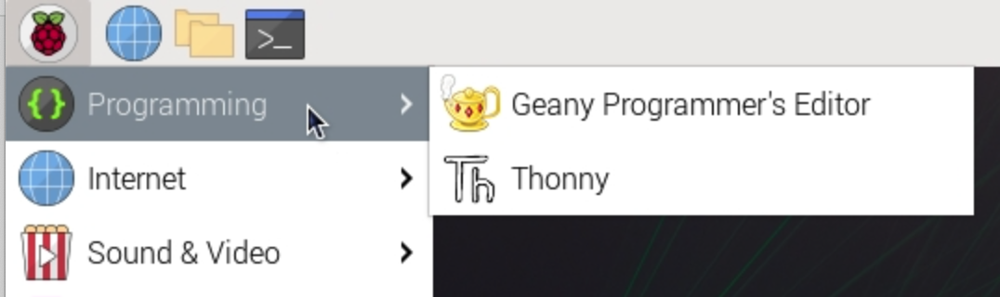

# Getting started

1. With your Raspberry Pi switched off, connect your Raspberry Pi Camera to a camera port.
    

2. Switch on your Raspberry Pi, and make sure you have [installed](index.md) the `picamzero` library.

3. Open a Python editor (e.g. Thonny) on your Raspberry Pi.

    

4. Type in this code, save it and then run it:

```
from picamzero import Camera
cam = Camera()
cam.take_photo("helloworld.jpg")
```

You will find your photo in the directory where you saved your Python file.

Next, take a look at the [methods](methods.md) to find out how to do other things with your camera.